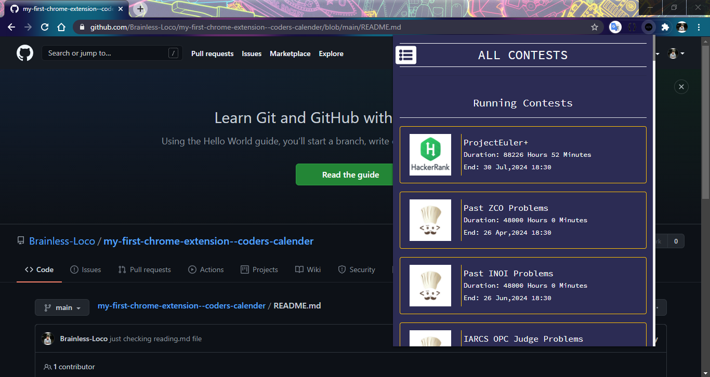
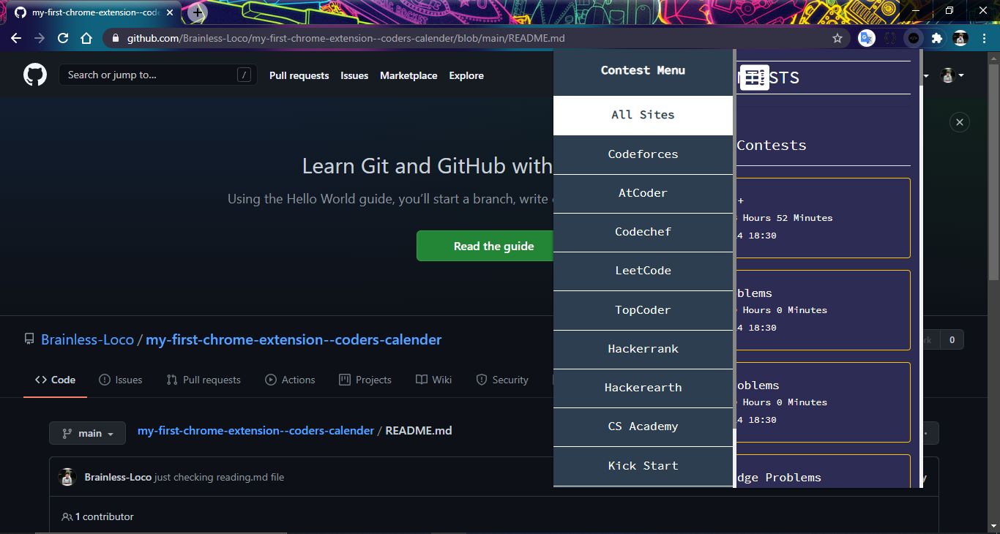
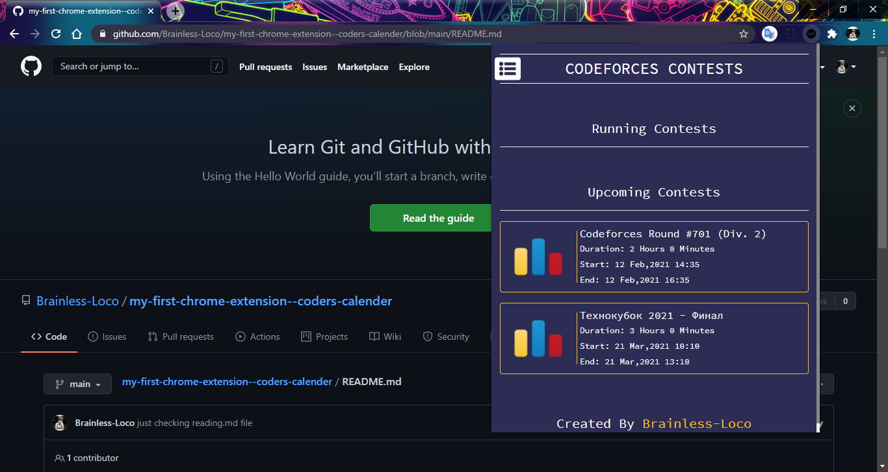
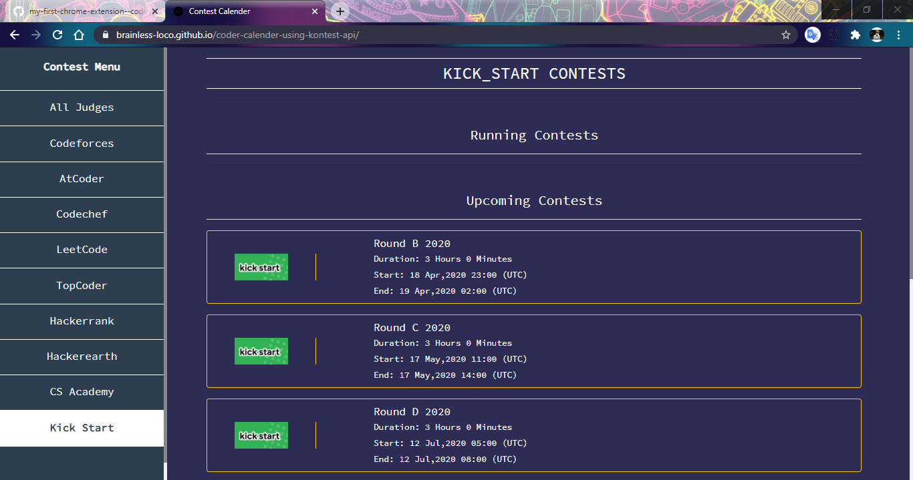

# my-first-chrome-extension--coders-calender

I'm very excited to say that I finally tried to make a google Chrome Extension and I became successful. It worked perfectly on my local machine.
For uploading it to google chrome webstore, I need to have a developer account there and pay $5 to google and I currently not able to pay this. So I'm just uploading it on Github as one of my pet project. 

Here are some Screeshots of the extenstion:
 
 

 

 

I also mad the webpage version, you can find that here : https://github.com/Brainless-Loco/coder-calender-using-kontest-api

Here is a screenshot of web version:

 

Thanks to kontest.net for their free api. I used this api to get informations about contests and showed them to this extension.

Thanks to Stack-Overflow as always!

You can give you feedback.

<h1>Thank You!!!<h1>